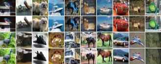
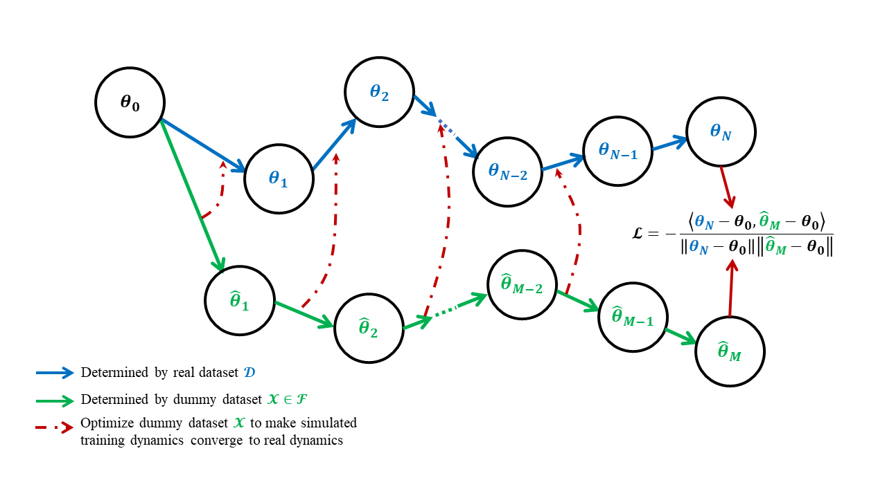

# <div align="center"> Simulating Training Dynamics to Reconstruct Training Data from Deep Neural Networks </div>

> This repository contains code for the paper "Simulating Training Dynamics to Reconstruct Training Data from Deep Neural Networks".

<table align="center">
  <tr>
    <td align="center"> 
       
      <br>
      <em style="font-size: 13px;">  <strong style="font-size: 13px;">Figure 1:</strong> Reconstructed training samples from a multi-class ResNet-18 using SimuDy(rows 1, 3), and the corresponding nearest neighbors from the training set (rows 2, 4).
    </td>
  </tr>
</table>

# Abstract

Whether deep neural networks (DNNs) memorize the training data is a fundamental open question in understanding deep learning. A direct way to verify the memorization of DNNs is to reconstruct training data from DNNs’ parameters. Since parameters are gradually determined by data throughout training, characterizing training dynamics is important for reconstruction. Pioneering works rely on the linear training dynamics of shallow NNs with large widths, but cannot be extended to more practical DNNs which have non-linear dynamics. We propose Simulation of training Dynamics (SimuDy) to reconstruct training data from DNNs. Specifically, we simulate the training dynamics by training the model from the initial parameters with a dummy dataset, then optimize this dummy dataset so that the simulated dynamics reach the same final parameters as the true dynamics. By incorporating dummy parameters in the simulated dynamics, SimuDy effectively describes non-linear training dynamics. Experiments demonstrate that SimuDy significantly outperforms previous approaches when handling non-linear training dynamics, and for the first time, most training samples can be reconstructed from a trained ResNet’s parameters.

<table align="center">
  <tr>
    <td align="center"> 
       
      <br>
      <em style="font-size: 16px;">  <strong style="font-size: 16px;">Figure 2:</strong> Overview of our proposed <strong style="font-size: 16px;">SimuDy</strong>.
    </td>
  </tr>
</table>

# 👉 Setup
First, download the repo:
```
git clone https://github.com/BlueBlood6/SimuDy.git
```

# 🔥 Quick Start

Let's reconstruct training dataset from a ResNet-18 trained on 20 images!

Train the model on a subset of CIFAR-10 from pre-trained initial parameters $θ_0$ to final parameters $θ_f$

```
python ./train.py --num_imgs_per_class 2 --lr 1e-2 --bs 20
```

Assuming training hyper-parameters are known, to reconstruct training dataset, simply run

```
python ./recons.py --num_imgs_per_class 2 --tlr 1e-2 --bs 20 --rec_lr 1e-2
```

To measure reconstruction results quantitatively and qualitatively, simply run

```
python ./metrics.py --num_imgs_per_class 2 --tlr 1e-2 --rlr 1e-2 --bs 20 --rbs 20 --linear 0 --rec_lr 1e-2 --eval_epoch 10 --eval_step 10 # quantitatively 
python ./draw_pics.py --num_imgs_per_class 2 --tlr 1e-2 --rlr 1e-2 --bs 20 --rbs 20 --linear 0 --rec_lr 1e-2 --eval_epoch 10 --eval_step 10 # qualitatively
```

With hyper-parameters unknown, run grid search to identify suitable hyper-parameters
```
bash grid_search.sh
```

After grid search, use suitable hyper-parameters to reconstruct training dataset

```
python ./recons.py --num_imgs_per_class 2 --tlr 1e-2 --bs 20 --rec_lr 1e-2 --rlr $suitable_lr --rbs $suitable_bs
```


# 📚 Citation
If you find this work helpful, please cite:

```
@inproceedings{tiansimulating,
  title={Simulating Training Dynamics to Reconstruct Training Data from Deep Neural Networks},
  author={Tian, Hanling and Liu, Yuhang and He, Mingzhen and He, Zhengbao and Huang, Zhehao and Yang, Ruikai and Huang, Xiaolin},
  booktitle={The Thirteenth International Conference on Learning Representations},
  year={2025},
  url={https://openreview.net/forum?id=ZJftXKy12x}
}
```